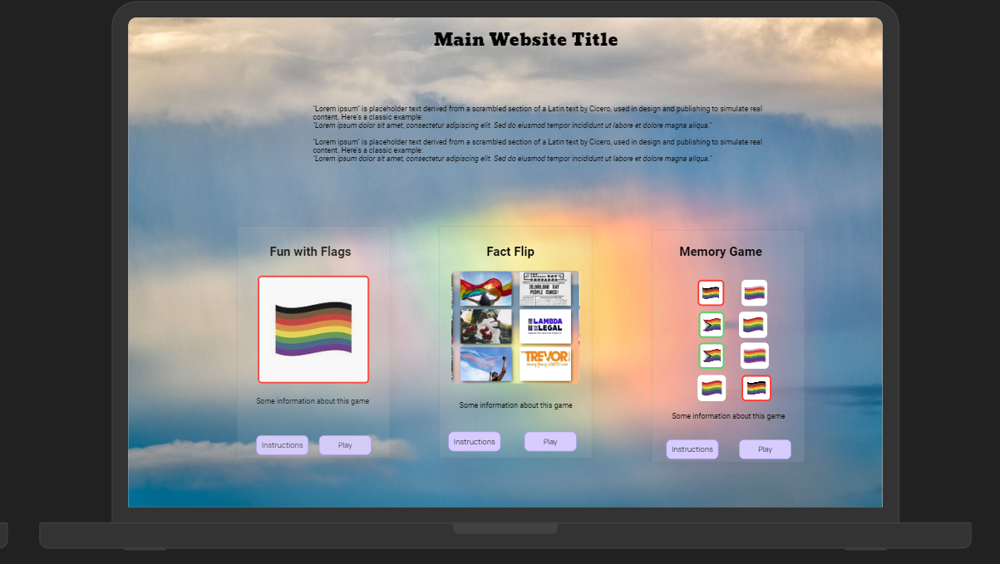
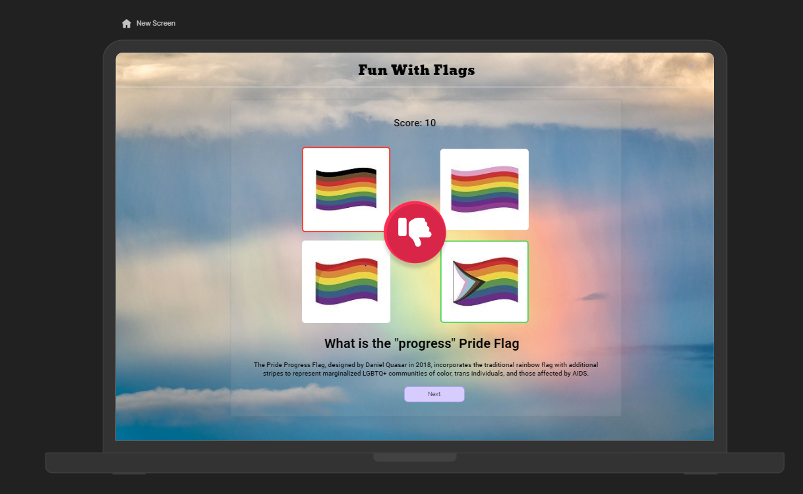

 
<h1 align="center"><strong>🏳️‍🌈🏳️‍🌈🏳️‍🌈 Proud Coders: July 2024 Hackathon 🏳️‍🌈🏳️‍🌈🏳️‍🌈</strong>

</h1>

# SUBMISSION

## Deployment

The project is deployed and can be accessed [here](https://dee-mcg.github.io/Hackathon-July-2024/).

## Intro

The focus of our project was education, the main barrier to discrimination and bias is ignorance. By making easily accessible education to terms and flags of the LGBTQIA+ community we hope to break down some of thos barriers. If any users enjoy our site we have quick links to key LGBT focused charities that users can donate to if they wish.

## Goals

### Problem
Even with the huge amount of progress with LGBT issues being brought forward that has presented challenges to those not part of the community with common terms and the history of the movement. 

### Objective
To build a fun and educational site to help people learn about Pride & LGBTQIA+ history through mini-games and interactive content.

### Target audience
Those not already in the LGBT community

### Benefits
Less ignorance and potential donations to key causes!

## Design

The main site design prototype was made with UIzard, only the home page and quiz page were planned for MVP and designed.

The header and adhoc pages were built using the same theme but without prototypes.

Some changes to the card backgrounds were done.

## Features

- A home page that serves as the base to access the interactive content
- Mobile responsive
- Flag Matching - Memory Card Game
- Quiz on Pride Flags - Also provides a fact about the target group
- Fact Flip - Contains cards with images, on click it flips to display the fact relating to that image
- Links to each developers githubs added to the footer

## Tech

Our project was made with HTML, CSS and Javascript. The bootstrap framework was used for speed of development

## Testing

| Test                                            | Steps                                                | Expected                                     | Actual |
| ----------------------------------------------- | ---------------------------------------------------- | -------------------------------------------- | ------ |
| Menu works on mobile                            | Open on mobile and click hamburger                   | Menu opens and all links work                | Pass   |
| Github links work as expected                   | Click github links in the footer                     | Opens developers github profile in a new tab | Pass   |
| Clicking the logo takes you home                | Click the logo from any page                         | Home page is displayed                       | Pass   |
| All pages are responsive                        | Using dev tools, shrink the pages down to 320px      | Website is responsive                        | Pass   |
|                                                 |                                                      |                                              |        |
| Memory game loads from home link                | Click 'play' on the memory game card on the homepage | Memory game loads                            | Pass   |
| Memory game cards unflip when incorrect         | Select 2 different cards on the memory game          | Cards do not stay flipped                    | Pass   |
| Memory cards stay flipped when correct          | Match 2 same cards on memory quiz                    | Cards remain flipped                         | Pass   |
| Results text displays when game ends            | Complete all matches on memory game                  | Winning text is displayed on the board       | Pass   |
|                                                 |                                                      |                                              |        |
| Fact Flip Page loads from home link             | Click 'play' on the fact flip card on the homepage   | Fact Flip page loads                         | Pass   |
| When you click a card, fact is displayed        | Click each card on fact flip page                    | All cards flip and fact displayed            | Pass   |
|                                                 |                                                      |                                              |        |
| Quiz Page loads from home link                  | Click 'play' on the quiz card on the homepage        | Quiz loads                                   | Pass   |
| Question and answers displayed when game starts | Start the quiz                                       | Question and 4 flags displayed on quiz start | Pass   |
| Correct Flag highlighted green                  | Select the correct flag on the quiz                  | Flag border turns green                      | Pass   |
| Incorrect flag highlighted red                  | Select the wrong flag on the quiz                    | Flag border turns red                        | Pass   |
| Fact displayed after guess                      | Answer a quiz question                               | Fact about correct answer displayed          | Pass   |

### Known Bugs

## Credits

Fact Images were all taken from:
- Google
- Pixabay
- Flag images were taken from [Volvo group](https://www.volvogroup.com/en/news-and-media/news/2021/jun/lgbtq-pride-flags-and-what-they-stand-for.html)
- Favicon icon from [Shutterstock](https://www.shutterstock.com/image-vector/graduation-cap-education-icon-drawing-sign-1186543396)
- Glass CSS from [css.glass](https://css.glass/)